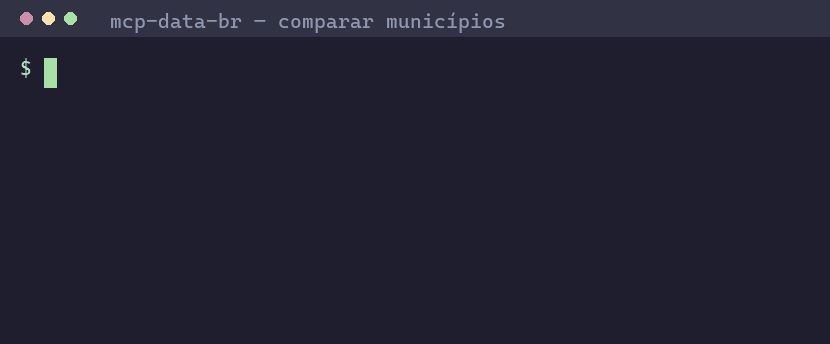

# mcp-data-br

**A collection of [Model Context Protocol](https://modelcontextprotocol.io/)
(MCP) servers for Brazilian public data — typed, traceable, and safe to call
from AI agents.**


[](https://github.com/FilipePessoa30/mcp-ibge/actions/workflows/ci.yml)


## What is mcp-data-br?

Brazilian public institutions (IBGE, INEP, Banco Central, dados.gov.br,
state and city open data portals, ...) publish a huge amount of free,
no-API-key data — but spread across many APIs, with inconsistent shapes,
encodings and documentation that are hard for an LLM to use safely.

**mcp-data-br** is a growing collection of small, focused MCP servers — one
per data source — that turn those public APIs into **typed, traceable
tools** an agent (Claude Desktop, Cursor, or any MCP-compatible client) can
call directly. Every tool across every module follows the same conventions:

- **Typed, validated responses** — every tool is backed by Pydantic models.
- **Traceable by design** — every response is `{"ok": ..., "data": ...,
  "metadata": {...}, "warnings": [...], "errors": [...]}`, with `metadata`
  (`source_name`, `source_url`, `official_source`, `endpoint`, `params`,
  `retrieved_at`, `period`, `territorial_level`, `license_note`, `version`,
  `cache_hit`) so any number can be checked against its official source.
- **Safe by default** — no shell execution, no arbitrary file/URL access,
  outbound requests restricted to an allowlist of official domains, input
  validation before any network call. See [docs/security.md](docs/security.md).
- **Local-first** — runs over `stdio`, no API keys, no external services
  beyond the public data source itself.

The project is organized as a single **uv workspace (monorepo)**: each data
source gets its own installable package under [`packages/`](packages/), all
sharing the same conventions and tooling.

## 30-second demo



> 🎥 GIF placeholder — see [Recording the demo GIF](#recording-the-demo-gif)
> below to generate `docs/assets/demo.gif`.

**Prompt** (typed into Claude Desktop / Cursor / any MCP client):

> "Compare Rio de Janeiro, Niterói and Maricá using official Brazilian public
> data."

**What the agent does** — no API keys, no scraping, just typed tool calls
over `stdio`:

```python
# 1. Resolve each name to an IBGE municipality (fuzzy match, accent/case-insensitive)
buscar_municipio(nome="Rio de Janeiro")
buscar_municipio(nome="Niterói")
buscar_municipio(nome="Maricá")

# 2. Get the 7-digit IBGE codes
obter_codigo_municipio(nome="Rio de Janeiro", uf="RJ")  # -> 3304557
obter_codigo_municipio(nome="Niterói", uf="RJ")          # -> 3303302
obter_codigo_municipio(nome="Maricá", uf="RJ")           # -> 3302904

# 3. Check which indicators are available before asking for them
#    (today: estimated population, agregado SIDRA 6579)

# 4. One call does the rest: resolves + compares + cites sources
comparar_municipios(
    municipios=[
        {"nome": "Rio de Janeiro", "uf": "RJ"},
        {"nome": "Niterói", "uf": "RJ"},
        {"nome": "Maricá", "uf": "RJ"},
    ],
    indicadores=["populacao_estimada"],
)
```

**Final answer, straight from `comparar_municipios`**:

| Município | UF | Estimated population (2024) |
| --- | --- | --- |
| Rio de Janeiro | RJ | 6,211,423 |
| Niterói | RJ | 516,981 |
| Maricá | RJ | 187,051 |

- **Source**: IBGE — Agregados/SIDRA, table `6579` (Estimativas de
  População), period `2024` — every row in `data.fontes` is a direct,
  openable URL on `servicodados.ibge.gov.br`.
- **Warnings**: none for this query — but if a municipality name were
  ambiguous, not found, or an indicator weren't implemented yet, that would
  show up explicitly in `warnings` / `data.municipios_nao_resolvidos` /
  `data.indicadores_nao_implementados` instead of a guessed number. See the
  [`compare_municipalities` recipe](examples/agent_recipes/compare_municipalities/)
  for the full request/response and error cases.

In other words:

- **Local-first** — runs over `stdio` on your machine, no hosted backend.
- **No API keys** — every data source is a free, public government API.
- **Official data sources** — every value is traceable to a
  `servicodados.ibge.gov.br` endpoint via `metadata`/`data.fontes`.
- **Structured responses** — `{"ok", "data", "metadata", "warnings",
  "errors"}` every time, ready for an agent to parse and act on.
- **Safe by default** — no shell access, no arbitrary URLs, outbound
  requests restricted to an allowlist (see [docs/security.md](docs/security.md)).
- **Agent-ready** — typed tools an LLM can call directly, with ready-made
  recipes in [examples/agent_recipes/](examples/agent_recipes/).

### Try it yourself

```bash
git clone https://github.com/FilipePessoa30/mcp-ibge.git mcp-data-br
cd mcp-data-br
uv sync --all-extras
uv run mcp-ibge
```

Minimal MCP client config (e.g. `claude_desktop_config.json`):

```json
{
  "mcpServers": {
    "ibge": {
      "command": "uvx",
      "args": ["mcp-ibge"]
    }
  }
}
```

Then ask the prompt above. More configs (Cursor, Open WebUI, dev/local
checkout) are in [examples/](examples/); more ready-made prompts are in
[examples/agent_recipes/](examples/agent_recipes/).

### Recording the demo GIF

To regenerate `docs/assets/demo.gif`, record a terminal session running an
MCP client (or `uv run mcp-ibge` plus a small script) asking the prompt
above, then convert it to a GIF. Two common ways:

- **[VHS](https://github.com/charmbracelet/vhs)** (recommended — scripted,
  reproducible):

  ```bash
  # demo.tape
  Output docs/assets/demo.gif
  Set FontSize 16
  Set Width 1000
  Set Height 600
  Type "uv run mcp-ibge"
  Enter
  Sleep 1s
  # ... drive your MCP client / script here, then let it settle
  Sleep 2s
  ```

  ```bash
  vhs demo.tape
  ```

- **[asciinema](https://asciinema.org/) + [agg](https://github.com/asciinema/agg)**:

  ```bash
  asciinema rec demo.cast
  # run the demo, then Ctrl-D to stop
  agg demo.cast docs/assets/demo.gif
  ```

Keep the recording under ~30 seconds and trim dead time so the GIF stays
small enough for the README to load quickly.

## Available modules

| Module | Status | Data | Docs |
| --- | --- | --- | --- |
| [`mcp-ibge`](packages/mcp_ibge/) | **Stable** | IBGE — geographic locations (regions, states, municipalities, districts) and Agregados/SIDRA statistical aggregates | [README](packages/mcp_ibge/README.md) · [docs](packages/mcp_ibge/docs/) |

## Planned modules

mcp-data-br is designed to grow. Planned/possible future modules include
`mcp-sidra` (a dedicated SIDRA module, split out of `mcp-ibge`), `mcp-inep`
(education data), `mcp-dados-gov-br` (generic dados.gov.br access),
`mcp-bcb` (Banco Central indicators) and `mcp-rio` (Rio de Janeiro open
data). See [docs/roadmap.md](docs/roadmap.md) for details — none of these
are implemented yet, but the workspace is structured so they can be added as
new packages without touching existing ones.

## Quick start

Requires **Python 3.11+** and [uv](https://docs.astral.sh/uv/).

```bash
git clone https://github.com/FilipePessoa30/mcp-ibge.git mcp-data-br
cd mcp-data-br
uv sync --all-extras
uv run mcp-ibge
```

This starts the `mcp-ibge` server over `stdio`. For ready-to-use MCP client
configs (Claude Desktop, Cursor, Open WebUI) and example prompts, see
[examples/](examples/) and
[packages/mcp_ibge/docs/client_setup.md](packages/mcp_ibge/docs/client_setup.md).

For the full feature list, available tools, configuration options and
roadmap of the IBGE module, see
**[packages/mcp_ibge/README.md](packages/mcp_ibge/README.md)**.

## Project layout

```
mcp-data-br/
├── pyproject.toml          # uv workspace root (virtual project)
├── packages/
│   └── mcp_ibge/             # mcp-ibge: IBGE Localidades + Agregados/SIDRA
│       ├── src/mcp_ibge/
│       ├── tests/
│       ├── docs/
│       └── README.md
├── docs/                    # Monorepo-level docs (architecture, roadmap, security, data sources)
├── examples/                # MCP client configs (Claude Desktop, Cursor, Open WebUI) and prompts
└── evals/                   # Evaluation datasets and reports (placeholder)
```

See [docs/architecture.md](docs/architecture.md) for how the workspace and
modules are organized, and [docs/architecture.md#adding-a-new-module](docs/architecture.md#adding-a-new-module)
for what a new module needs.

## Documentation

- [docs/index.md](docs/index.md) — documentation index
- [docs/architecture.md](docs/architecture.md) — workspace structure and
  module conventions
- [docs/data_sources.md](docs/data_sources.md) — shared response envelope
  and data source registry
- [docs/security.md](docs/security.md) — security baseline
- [docs/roadmap.md](docs/roadmap.md) — current and planned modules

## Contributing

Contributions are welcome — bug reports, new tools, new modules,
documentation and tests. See [CONTRIBUTING.md](CONTRIBUTING.md) for the
development setup (uv workspace, lint/format/test commands) and guidelines.

## 🇧🇷 Sobre o projeto (resumo em português)

**mcp-data-br** é uma coleção de servidores [MCP](https://modelcontextprotocol.io/)
para dados públicos brasileiros, organizados como um único workspace
(monorepo) onde cada fonte de dados ganha seu próprio pacote em
[`packages/`](packages/). A primeira entrega é o **mcp-ibge**, com dados de
localidades e agregados do SIDRA do IBGE — veja
[packages/mcp_ibge/README.md](packages/mcp_ibge/README.md). O projeto foi
desenhado para crescer com novos módulos (ex.: SIDRA dedicado, INEP, Banco
Central, dados.gov.br, Rio de Janeiro) seguindo as mesmas convenções de
respostas tipadas, rastreáveis e seguras — veja
[docs/roadmap.md](docs/roadmap.md).

## License

[MIT](LICENSE)
